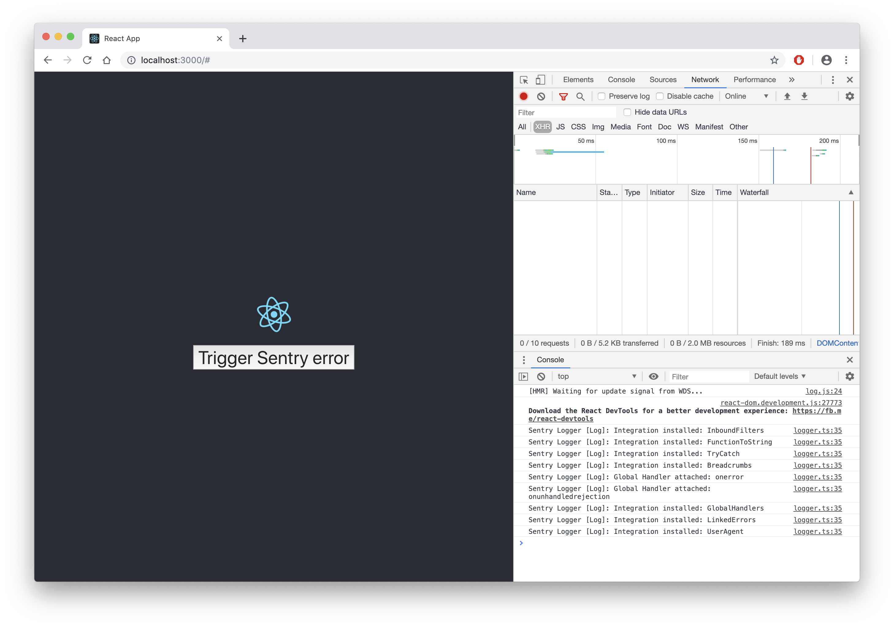
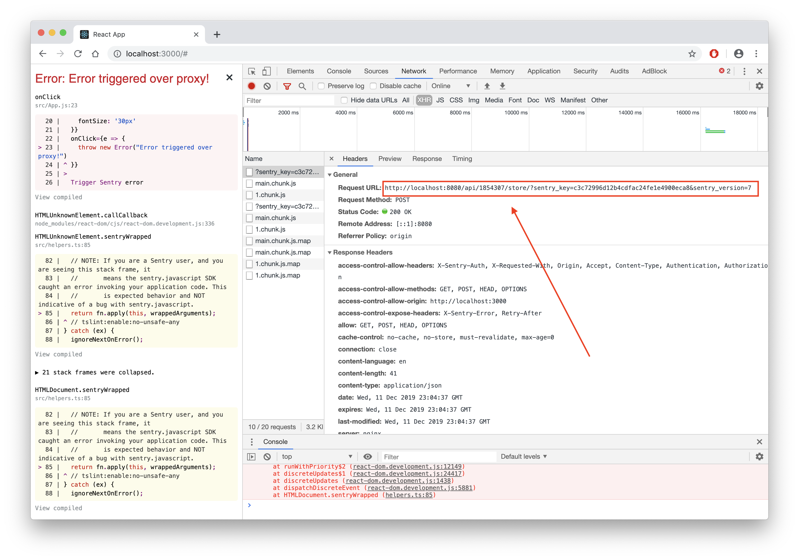
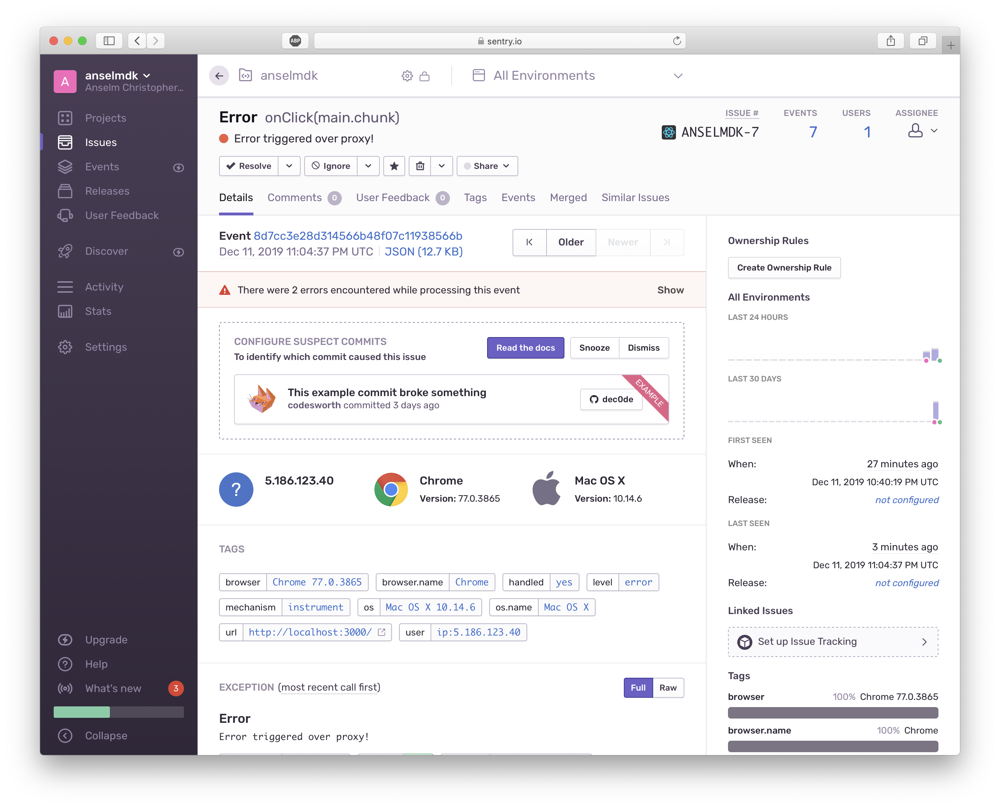

# CRA Sentry Proxy POC

This is a proof of concept on how to run Sentry over a proxy.

## Running Locally

1. Open a terminal tab and start the client: `npm start`
2. Open a second terminal tab and start the server: `node src/server.js`

## Steps Done

* Signed up for Sentry at https://sentry.io/signup using my Github account
* Followed Sentry's React getting started guide:  
`npm install @sentry/browser`  
Being told to do the following (**NOTE** the dsn is the one I signed up with):  
```js
import React from 'react';
import ReactDOM from 'react-dom';
import * as Sentry from '@sentry/browser';
import App from 'src/App';

Sentry.init({dsn: "https://c3c72996d12b4cdfac24fe1e4900eca8@sentry.io/1854307"});

ReactDOM.render(<App />, document.getElementById('root'));
```
* Implementing, and making sure errors were triggered
* Introducing `src/server.js` and implementing the proxy there  
Search for [1854307](https://github.com/anselmdk/cra-sentry-proxy-poc/search?q=1854307) to see everywhere this is used
* Double checking that events are actually sent over the proxy


## Screenshots

### App



### App with error triggered



### Error in Sentry



